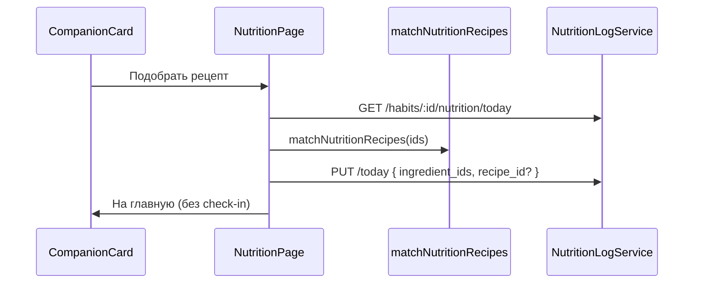

# Дизайн: «Правильное питание» — рецепты ПП без таймеров и отметок

**Дата:** 2026-06-27  
**Статус:** утверждён (ревизия 2 — привычка-спутник)  
**Контекст:** пользователь выбирает «Правильное питание» в онбординге, но **не хочет таймеров, минут и кнопок «выполнено»**. Ценность — подобрать и показать ПП-рецепт из продуктов в холодильнике. Вариант A: курируемая база, без AI.

---

## 1. Продуктовая модель: привычка-спутник

«Правильное питание» — не ежедневная **задача с дедлайном**, а **спутник** (companion habit): полезный инструмент внутри трекера привычек.

| Обычная светлая привычка | Спутник (nutrition) |
|--------------------------|---------------------|
| Цель на день, таймер/сессия | Нет цели и таймера |
| Check-in success / fail | **Нет check-in** |
| Срыв в конце дня | **Не участвует** в day-close |
| Бейдж «Выполнено» / «Не выполнено» | Нет статуса выполнения |
| Влияет на streak срывов | **Не влияет** на срывы и pledge |

Пользователь по-прежнему **выбирает** её в онбординге (Путь Энергии, лимит 6 привычек) — это осознанный «плюс» к плану, а не ещё один пункт дисциплины.

**Ранний подъём** остаётся обычной привычкой с кнопкой «Подъём выполнен» (это факт дня, не таймер на 12 минут). Ревизия 2 касается только nutrition.

### Цели v1

1. Продукты из холодильника → **2–3 ПП-рецепта** с пошаговой готовкой.
2. **Никаких таймеров**, минут в плане дня, прогресс-баров и «Готово, съел».
3. На главной — карточка-**вход в рецепты**, не задача с галочкой.
4. Статическая база + матчинг в `@mytodo/domain`, demo-режим.

### Вне scope (v1)

- AI, фото, голос, КБЖУ-калькулятор, список покупок
- Check-in, complete, streak, срывы для nutrition
- Прогрессия цели

---

## 2. Пользовательский сценарий

```
Главная → карточка «Правильное питание»
  подзаголовок: «Рецепт из того, что есть дома»
  [Подобрать рецепт]  — всегда доступна, без бейджа выполнения
    ↓
/habits/:habitId/nutrition
    ↓
Шаг 1 — Продукты (чипы + поиск, ≥2 ингредиента)
    ↓
Шаг 2 — 2–3 варианта рецепта
    ↓
Шаг 3 — Рецепт (состав, шаги, способ готовки)
  [← Назад]  [← На главную]   — без «отметить выполнение»
```

### Карточка на главной

- **Нет** бейджа success / fail / pending / «В процессе»
- **Нет** полоски прогресса и кнопки «+»
- **Нет** блока в `daily_plan` (уже так: `current_goal = 0`)
- Опционально в развороте: «Последний рецепт: Овощной омлет» (из сохранённого log)
- Одна кнопка: **«Подобрать рецепт»** (или «Открыть рецепт», если уже на шаге 3 в log)

### Восстановление при повторном входе

| Log | Экран |
|-----|-------|
| нет | Шаг 1 |
| `ingredient_ids`, без `recipe_id` | Шаг 1 (предзаполнено) |
| `recipe_id` | Шаг 3 (можно «Назад» к вариантам) |

---

## 3. Архитектура

| Слой | Что добавляем |
|------|----------------|
| `packages/shared` | Каталог, схемы, `isNutritionHabit()`, **`isCompanionLightHabit()`** |
| `packages/domain` | `matchNutritionRecipes()`; day-close **skip** companion |
| `apps/api` | `habit_nutrition_logs` (только состояние UI), GET/PUT |
| `apps/web` | `NutritionPage`, карточка-спутник на главной, demo |



**Check-in pipeline не используется.**

---

## 4. Интеграция с существующей системой

### 4.1 Таймеры и дневной план

Уже сейчас:

- `isNonSessionLightCategory(healthy_nutrition)` → нет сессий на Today
- `current_goal = 0` → нет блоков в `daily_plan`
- `estimateHabitComfortMinutes` → `0`

Дополнительно в UI: не рендерить для companion всё, что завязано на `habit.checkin` и `block`.

### 4.2 Day-close

В `DayCloseService.closeHabitDay` (и domain `resolveDayClose`):

```ts
if (isCompanionLightHabit(habit)) {
  return null; // не трогаем check-in, stats, pledge
}
```

Итог: nutrition **никогда не получает fail** в 23:59 и **не срывает pledge**.

### 4.3 Статистика и Progress

| Метрика | Поведение |
|---------|-----------|
| `completed_today` | Nutrition не учитывается (нет check-in) |
| `relapses_this_week` | Не учитывается |
| Календарь привычки (Progress) | Дни **нейтральные** (нет success/fail dot) или скрыть ряд — v1: нейтральный стиль `companion` |
| Global streak | Только по «настоящим» привычкам (без companion в расчёте срыва) |

### 4.4 Прогрессия

`applyDayProgression` + `calibrateHabit`: для nutrition `growthStep: 0`, прогрессия no-op (на случай legacy check-in в БД).

### 4.5 Идентификация

```ts
isNutritionHabit(habit) :=
  category_key === 'healthy_nutrition'
  || name.trim() === NUTRITION_HABIT_NAME

isCompanionLightHabit(habit) := isNutritionHabit(habit)
// v2: сюда же можно добавить другие «спутники»
```

### 4.6 UI-тексты

- `formatGoalLabel` → **`Рецепты ПП из ваших продуктов`** (не «цель: 0 мин»)
- `format.ts` / badge: для companion не вызывать `statusLabel` по check-in

### 4.7 Онбординг

Без изменений логики выбора. Описание в `lightPaths.ts` уже про холодильник. В `TZ.md` — уточнить, что это спутник, не timed habit.

---

## 5. Модель данных

### Таблица `habit_nutrition_logs`

Только **состояние подборщика** (удобство при возврате), не «выполнение».

| Поле | Тип | Описание |
|------|-----|----------|
| `id` | uuid | PK |
| `user_id` | uuid | FK |
| `habit_id` | uuid | FK |
| `date` | date | Локальная дата (сброс подборщика раз в день — опционально; v1: храним последнее состояние на дату) |
| `ingredient_ids` | jsonb | `string[]` |
| `recipe_id` | varchar(64) | nullable |
| `updated_at` | timestamptz | |

**Нет** `completed_at`. **Unique** `(habit_id, date)`.

Сброс на новый день: при `GET /today` если `date < today` — клиент начинает с шага 1; старый log не мешает (новая запись на новую дату).

### API

| Метод | Путь | Тело | Ответ |
|-------|------|------|-------|
| GET | `/api/v1/habits/:id/nutrition/today` | — | `{ log: … \| null }` |
| PUT | `/api/v1/habits/:id/nutrition/today` | `{ ingredient_ids, recipe_id? }` | log |

**Нет** `POST /today/complete`.

`TodayService`: поле `nutrition_log` на light habit (как `reading` у книг) — для подзаголовка «Последний рецепт: …».

---

## 6. Каталог и матчинг

Без изменений от ревизии 1:

- ~80 ингредиентов, 40 ПП-рецептов в `packages/shared/src/nutrition/`
- `matchNutritionRecipes()` в domain, top-3, fallback `oat-apple`, `veg-omelet`, `protein-salad`
- Матчинг на клиенте

---

## 7. Frontend

### Роут

`/habits/:habitId/nutrition` → `NutritionPage`

### `DailyPlanHabitRow` — режим companion

Отдельная ветка рендера (или `CompanionHabitRow`):

- иконка 🥗, название, подпись с последним рецептом
- кнопка «Подобрать рецепт»
- **не** рендерить: badge статуса, expand с прогрессом, таймер, skip, pledge UI для этой карточки

### `NutritionPage`

Шаги 1–3, на шаге 3 только навигация назад/домой.

### Demo

In-memory log, GET/PUT — без check-in.

---

## 8. Ошибки и краевые случаи

| Ситуация | Поведение |
|----------|-----------|
| < 2 ингредиентов | «Подобрать» disabled |
| Нет совпадений | Fallback-рецепты |
| Не nutrition habit | 404 / redirect |
| Неизвестный id в PUT | 400 |

**Убрано:** complete, 409 после complete, redirect при success check-in.

---

## 9. Тестирование

| Область | Сценарии |
|---------|----------|
| `match.test.ts` | скоринг, fallback |
| `day-close.test.ts` | companion **не** закрывается, **не** fail |
| `nutrition.test.ts` | GET/PUT, validation |
| `today.test.ts` | `nutrition_log` в ответе, нет ложного pending |
| UI | карточка без бейджа, flow без complete |

---

## 10. План поставки

1. Shared + domain (каталог, match, `isCompanionLightHabit`, day-close skip)
2. API (миграция, log service, routes, today)
3. Web (NutritionPage + companion card)
4. Demo + docs/API.md

Оценка: **3–4 дня** (проще ревизии 1 — нет check-in/complete).

---

## 11. Зафиксированные решения (ревизия 2)

| Вопрос | Решение |
|--------|---------|
| Таймеры | **Нет** |
| Отметка «выполнено» | **Нет** |
| Check-in | **Не используется** |
| Day-close / срывы | **Исключена** |
| Роль на главной | Карточка-спутник, кнопка в рецепты |
| Ценность | Подбор и показ ПП-рецепта |
| Ранний подъём | Без изменений (отдельная модель) |
| Генерация рецептов | Курируемая база (вариант A) |

---

## 12. Самопроверка (ревизия 2)

| Проверка | OK |
|----------|-----|
| Нет противоречия «без отметок» vs «Готово, съел» | Убрано |
| Нет таймера 12 мин | Не в плане, goal=0 |
| Day-close не ломает UX срывами | skip companion |
| Progress не красит дни в fail | нейтрально |
| Меньше API | только GET/PUT log |
| Онбординг | спутник в составе 6 — ок |
